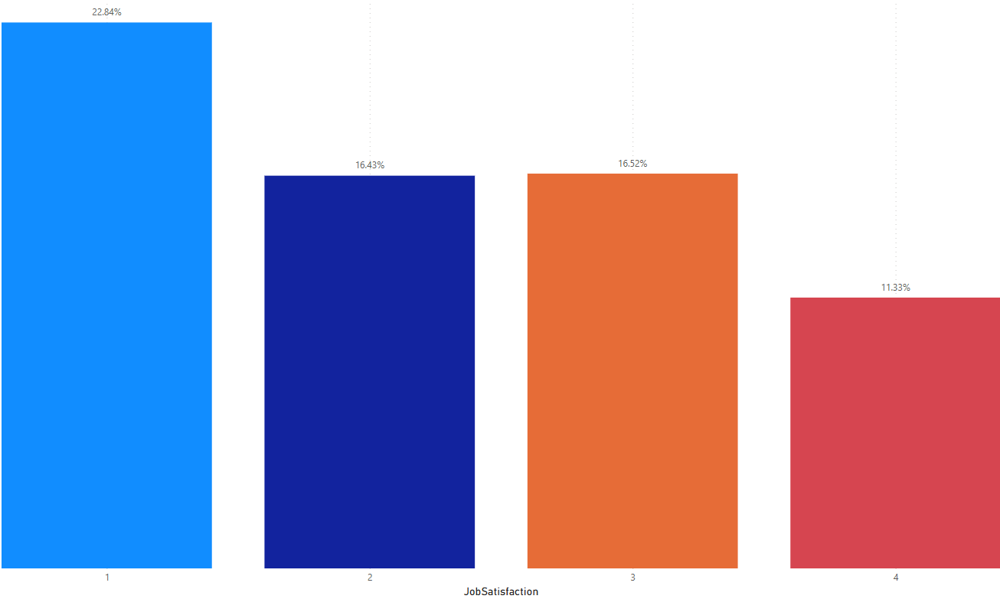
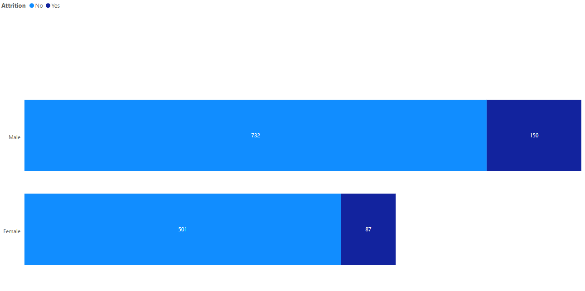

# 📊 HR Analytics Dashboard - Employee Attrition Analysis

## 🚀 Project Overview
This Power BI dashboard analyzes employee attrition trends using the IBM HR dataset.
The goal is to help HR teams understand why employees leave and what factors influence retention.

## 🔍 Key Insights
- **Low job satisfaction (score = 1) leads to the highest attrition rate (22.84%).**
- **Sales & R&D departments experience the most turnover.**
- **Salary alone is not the main factor**—job satisfaction and career growth matter more.

## 🛠 Tools & Technologies Used
- **Power BI** for visualization
- **DAX (Data Analysis Expressions)** for calculated measures
- **Kaggle dataset** for HR analytics

## 📂 Files Included
- `HR-Analytics-Dashboard.pbix` → Power BI file
- `HR-Dataset.csv` → kaggle dataset used
- `Screenshots/` → Dashboard images
- `DAX-Measures.txt` → List of custom DAX calculations
- `README.md` → Project documentation

## 📸 Dashboard Screenshots
### 1️⃣ HR Attrition Overview

### 2️⃣ Job Satisfaction vs. Attrition

### 3️⃣ Gender-Wise Attrition

## 🔗 Links to Full Analysis
📖 **Medium Blog Post**: [Read the full analysis](https://medium.com/@darianwashington8/hr-attrition-dashboard-how-i-used-power-bi-to-analyze-employee-turnover-361fdd0b4e47)
💼 **Portfolio**: [View All My Projects](https://www.datascienceportfol.io/Darianwashington8/projects/2)
